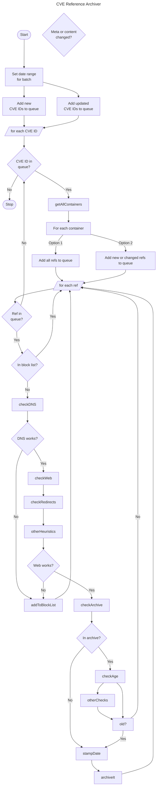

# Archiver Process

This document describes the CVE Reference Archiver process logic at a fairly high level. Very much subject to change as this is an early-stage pilot project.

```mermaid
---
title: CVE Reference Archiver
---
flowchart TD
    start@{ shape: stadium, label: "Start" }
    stop@{ shape: stadium, label: "Stop" }

    setPeriod@{ shape: rect, label: "Set date range\nfor batch" }
    addNew@{ shape: rect, label: "Add new\nCVE IDs to queue" }
    addUpdated@{ shape: rect, label: "Add updated\nCVE IDs to queue" }

    forEachCVEID@{ shape: lean-r, label: "for each CVE ID" }

    cveInQueue?@{ shape: diamond, label: "CVE ID in\nqueue?" }

    forEachContainer@{ shape: rect, label: "For each container" }
    addAllRefs@{ shape: rect, label: "Add all refs to queue" }
    addDiffRefs@{ shape: rect, label: "Add new or changed refs to queue" }
    refInQueue?@{ shape: diamond, label: "Ref in\nqueue?" }

    forEachRef@{ shape: lean-r, label: "for each ref"}

    inBlockList?@{ shape: diamond, label: "In block list?" }
    dnsWorks?@{ shape: diamond, label: "DNS works?" }
    webWorks?@{ shape: diamond, label: "Web works?" }
    inArchive?@{ shape: diamond, label: "In archive?" }
    metaOrContentChanged?@{ shape: diamond, label: "Meta or content\nchanged?" }


    start --> setPeriod
    setPeriod --> addNew
    setPeriod --> addUpdated
    addNew --> forEachCVEID
    addUpdated --> forEachCVEID

    forEachCVEID --> cveInQueue?

    cveInQueue? --> | No | stop
    cveInQueue? --> | Yes | getAllContainers

    getAllContainers --> forEachContainer

    forEachContainer --> | Option 1 | addAllRefs
    forEachContainer --> | Option 2 | addDiffRefs
    addAllRefs --> forEachRef
    addDiffRefs --> forEachRef
    forEachRef --> refInQueue?

    refInQueue? --> | No | cveInQueue?
    refInQueue? --> | Yes | inBlockList?

    inBlockList? --> | Yes | forEachRef
    inBlockList? --> | No | checkDNS
    checkDNS --> dnsWorks?
    dnsWorks? --> | No | addToBlockList
    addToBlockList --> forEachRef
    dnsWorks? --> | Yes | checkWeb
    checkWeb --> checkRedirects
    checkRedirects --> otherHeuristics
    otherHeuristics --> webWorks?
    webWorks? --> | No | addToBlockList
    webWorks? --> | Yes | checkArchive
    checkArchive --> inArchive?

    inArchive? --> | No | stampDate
    inArchive? --> | Yes | checkAge

    checkAge --> otherChecks
    otherChecks --> old?

    checkAge --> old?

    old? --> | Yes | stampDate
    old? --> | No | forEachRef
    
    stampDate --> archiveIt
    archiveIt --> forEachRef
```
