# CVE Reference Archiver Process

This document describes the CVE Reference Archiver process logic at a fairly high level. Very much subject to change as this is an early-stage pilot project.

There are a variety of reasons that DNS, web access, and archive attempts can fail or have errors. Here's a starting list.

1. Domain is simply gone, no current presence or redirect (simple enough to check and block list)
2. Domain has changed hands and is no longer relevant, may redirect to home or landing page (oh well, may be detectable)
3. Domain and site are active but old advisory URLs do not work (404, detectable, add to block list with confidence)
4. Domain and site are active but old advisory URLs redirect to new advisory URLs (good!)
5. Domain and site are active but old advisory URLs redirect to a landing page (boo, may be detectable)
6. Reference passes DNS and "web" checks but site detects and blocks ArchiveBox (robots.txt, user-agent, etc.)

Here is an [image](archiver_pilot_process.png) of the Mermaid chart.

```mermaid
---
title: CVE Reference Archiver
---
flowchart TD
    start@{ shape: stadium, label: "Start" }
    stop@{ shape: stadium, label: "Stop" }

    setPeriod@{ shape: rect, label: "Set date range for batch, e.g., last 24 hours" }
    addNew@{ shape: rect, label: "Add new CVE IDs to queue" }
    addUpdated@{ shape: rect, label: "Add updated CVE IDs to queue" }

    forEachCVEID@{ shape: rect, label: "Process CVE ID queue" }
    cveInQueue?@{ shape: diamond, label: "CVE ID in queue?" }
    processCVEID@{ shape: rect, label: "Process CVE ID" }
    getAllContainers@{ shape: rect, label: "Check each container" }
    addAllRefs@{ shape: rect, label: "Add all references to queue" }
    addDiffRefs@{ shape: rect, label: "Add new or changed references to queue" }

    forEachRef@{ shape: rect, label: "Process reference queue"}
    refInQueue?@{ shape: diamond, label: "Reference in queue?" }
    archiveError?@{ shape: diamond, label: "Error archiving?" }
    checkWeb@{ shape: rect, label: "Check web"}
    checkRedirects@{ shape: rect, label: "Check redirects (specific advisory --> generic page)"}
    checkHeuristics@{ shape: rect, label: "Check other heuristics? (size?, date?)"}
    inBlockList?@{ shape: diamond, label: "In block list?" }
    webWorks?@{ shape: diamond, label: "Web works?" }
    checkDNS@{ shape: rect, label: "Check DNS" }
    dnsWorks?@{ shape: diamond, label: "DNS works?" }
    addToBlockList@{ shape: rect, label: "Add to block list (conditions may be transient, may want to remove items from block list)"}

    checkArchive@{ shape: rect, label: "Check archive"}
    inArchive?@{ shape: diamond, label: "In archive?" }
    checkAge@{ shape: rect, label: "Check age, multiple intervals?"}
    checkOther@{ shape: rect, label: "Other checks?"}
    old?@{ shape: diamond, label: "Old?" }

    archiveIt@{ shape: rect, label: "Archive it!"}
    archiveErrorLog@{ shape: rect, label: "Log archive error"}
    addToRetryQueue@{ shape: rect, label: "Add to retry queue?"}
    retry?@{ shape: diamond, label: "Retry?" }

    start --> setPeriod
    setPeriod --> addNew
    setPeriod --> addUpdated
    addNew --> forEachCVEID
    addUpdated --> forEachCVEID

    forEachCVEID --> cveInQueue?
    cveInQueue? --> | No | stop
    cveInQueue? --> | Yes | processCVEID
    processCVEID --> getAllContainers
    getAllContainers --> | Option 1 | addAllRefs
    getAllContainers --> | Option 2 | addDiffRefs
    addAllRefs --> forEachRef
    addDiffRefs --> forEachRef

    forEachRef --> refInQueue?
    refInQueue? --> | No | cveInQueue?
    refInQueue? --> | Yes | inBlockList?
    inBlockList? --> | Yes | forEachRef
    inBlockList? --> | No | checkDNS
    checkDNS --> dnsWorks?
    dnsWorks? --> | No | addToBlockList
    addToBlockList --> forEachRef
    dnsWorks? --> | Yes | checkWeb
    checkWeb --> checkRedirects
    checkRedirects --> checkHeuristics
    checkHeuristics --> webWorks?
    webWorks? --> | No | addToBlockList
    webWorks? --> | Yes | checkArchive

    checkArchive --> inArchive?
    inArchive? --> | No | archiveIt
    inArchive? --> | Yes | checkAge
    checkAge --> | optional | checkOther
    checkOther --> old?
    checkAge --> old?
    old? --> | Yes | archiveIt
    old? --> | No | forEachRef

    archiveIt --> archiveError?
    archiveError? --> | No | forEachRef
    archiveError? --> | Yes | retry?
    retry? --> | Yes | archiveIt
    retry? --> | No | archiveErrorLog
    archiveErrorLog --> addToRetryQueue
    addToRetryQueue --> | Optional | addToBlockList
    addToRetryQueue --> forEachRef
```

